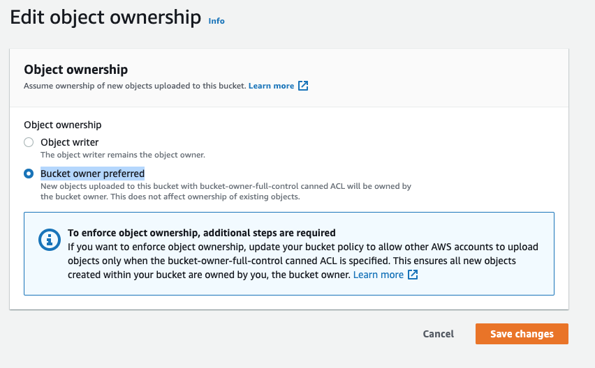

# GameAnalytics Export to AWS S3

GameAnalytics Raw and Event exports allow user to receive data into provided AWS S3. This
document provides a guidance on how to provision required AWS components along with
a set of permissions sufficient for the GameAnalytics export service.

## Overview

GameAnalytics export requires permissions to perform 's3:PutObject' action to the bucket where the data is supposed to be stored. The export is performed under `arn:aws:iam::118928031713:role/live-export-job-batch-copy-role` role, which one could grant the required permissions using the following policy:

``` json
{
  "Version": "2012-10-17",
  "Statement": [
    {
      "Effect": "Allow",
      "Principal": {
        "AWS": "arn:aws:iam::118928031713:role/live-export-job-batch-copy-role"
      },
      "Action": [
        "s3:PutObject",
        "s3:PutObjectAcl"
      ],
      "Resource": "arn:aws:s3:::<YOUR_BUCKET_NAME>/*"
    }
  ]
}
```

Where `YOUR_BUCKET_NAME` should be replaced with a name of the bucket to which the policy is attached.

Please ensure that the bucket has "Object Ownership" set to `Bucket owner preferred`:



## Helpers

To help you to provision all the required resources one can use pre-created AWS CloudFormation templates that you can find the [cfn](./cfn) directory.

### Using AWS CLI tool

Prerequisites:
- AWS CLI ([installing the AWS CLI](https://docs.aws.amazon.com/cli/latest/userguide/cli-chap-install.html))
- This repository (clone it)
- [JQ](https://stedolan.github.io/jq/download/)
- AWS Account
- Bucket where the CloudFormation templates will be uploaded

1. Upload the CloudFormation templates to S3 bucket:
   ```
   aws s3 sync ./cfn s3://<CFN_BUCKET_NAME>/gameanalytics/export/cfn/
   ```
2. Create the stack using aws cli:
   ```
   aws cloudformation create-stack --stack-name gameanalytics-data-export \
       --template-url https://<CFN_BUCKET_NAME>.s3.amazonaws.com/gameanalytics/export/cfn/s3.yaml \
       --parameters \
           ParameterKey=S3PolicyStackTemplateURL,ParameterValue=https://<CFN_BUCKET_NAME>.s3.amazonaws.com/gameanalytics/export/cfn/s3.yaml
   ```
3. Wait until the stack is created
   ```
   aws cloudformation describe-stacks --stack-name gameanalytics-data-export \
       | jq -r '.Stacks[].StackStatus'
   ```
   In case of successful creation of the stack you shoudl see `CREATE_COMPLETE`
4. Get the bucket ARN to provide the GameAnalytics export service
   ```
   aws cloudformation describe-stacks --stack-name gameanalytics-data-export \
       | jq -r '.Stacks[].Outputs[].OutputValue'
   ```
   If the stack is created successfully you should be able to see ARN of the created bucket, which would be similar to `arn:aws:s3:::gameanalytics-data-export-s3bucket-81mhh0wqeskx`
